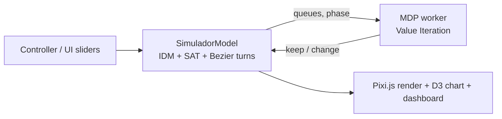

# Smart Traffic v2.0

Traffic-light control for a real Lima intersection (Av. Javier Prado x Av. Arequipa) using a Markov Decision Process solved with Value Iteration, plus a multi-agent Q-Learning extension to a 2x2 intersection grid.

> University coursework (Multi-Agent Systems / Applied Artificial Intelligence, deliverable PC4).

## Problem

Fixed-time traffic lights waste green time when demand is asymmetric (a main avenue crossing a secondary one). The goal is to let an agent decide when to keep or change the phase based on queue lengths, and to compare it with a threshold heuristic.

## What is in this repo

| Part | Stack | What it does |
|---|---|---|
| Web simulator (`src/`) | TypeScript, Vite, Pixi.js 8, D3 7, Web Worker | Single intersection, MDP/heuristic control, car physics, live dashboard |
| PC4 notebook (`Smart_Trafic_v2_PC4.ipynb`, report in `informe.md`) | Python, numpy, matplotlib (Colab) | 2x2 grid, one Q-Learning agent per light + central coordinator |
| `traffic_pygame.py` | Python, Pygame | Early prototype |

## Approach

### Single intersection (web)



- **State:** bucketed queue length per axis, current phase and extra flags (288 states).
- **Actions:** keep phase / change phase.
- **Reward:** penalties for waiting (25), phase change (6) and accidents (80); gamma = 0.95 (`src/types.ts`).
- **Car model:** Intelligent Driver Model, driver reaction-time and imprudence noise, SAT collision detection with a spatial grid, 8 Bezier turn paths.
- **Baseline:** a threshold heuristic that can be selected in the UI.
- The MDP is recomputed in a Web Worker so the render loop is not blocked.

### 2x2 grid (notebook)

- Nagel-Schreckenberg cellular automaton, so cars never collide by construction.
- 4 sub-agents (tabular Q-Learning, alpha 0.10, gamma 0.90, epsilon-greedy decaying from 1.0 to 0.05) decide keep/change; a central agent picks a global phase preference that adds an alignment reward ("green wave").
- 40 training episodes of 600 steps, seed 42. Full description in [`informe.md`](informe.md) (Spanish).

## Results

No measured results are stored in this repository: the notebook has no saved outputs and the "results" section of `informe.md` describes expected behavior, not measurements. There is no quantitative MDP vs heuristic vs fixed-time comparison yet.

## Tech stack

TypeScript 5, Vite 5, Pixi.js 8, D3 7, Web Workers; Python, numpy, matplotlib, Pygame.

## Getting started

```bash
npm install
npm run dev        # Vite dev server
npm run build
npm run typecheck
```

Notebook: open `Smart_Trafic_v2_PC4.ipynb` in Google Colab and run the cells in order.

## Project structure

```
src/
  model/        SimuladorModel, Carro (IDM, collisions, light, metrics)
  mdp/          AgenteMDP (Value Iteration) + Web Worker
  view/         Pixi renderer, D3 chart, dashboard, debug overlay
  controller/   main loop, UI bindings
  utils/        SAT, spatial grid, math, debounce
Smart_Trafic_v2_PC4.ipynb   multi-agent Q-Learning notebook
informe.md, resumen.md      project notes (Spanish)
```

## Credits

- Author of this repository: Jhamil Brijan Peña Cárdenas ([@Jaed69](https://github.com/Jaed69)).
- References: Nagel & Schreckenberg (1992); Watkins & Dayan (1992).

## License

No license file is included in this repository.
